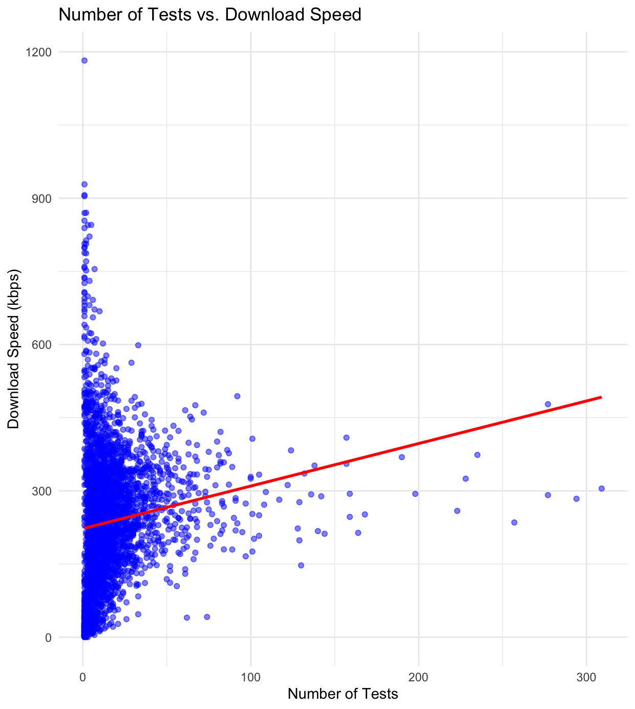

# Data Analysis of Internet Speeds

## **Project Overview**
This project analyzes internet download speeds across São Paulo city in Brazil, using spatial using spatial and statistical techniques. The primary goal is to understand the distribution of speeds, detect potential issues in coverage, and provide insights into network performance. The data used in this analysis comes from IBGE and Ookla databases, publicly available on the internet.

## **Workflow and Exectution Order**
To reproduce this analysis, follow the execution order of the scripts:

1. **`Importing_SaoPaulo_shape.R`** - Imports the shapefile of São Paulo and preparaes spatial data 
2. **`Importing_Tiles_Ookla.R`** - Loads and processes tile-based internet speed test data and other features.
3. **`Importing_Sites_Anatel.R`** - Incorporates network site data from Anatel Database for comparison.
4. **`Analyzing_Data.R`** - Conducts statistical analysis and visualizations
5. **`Visual_Analysis.R`** - Provides charts and graphical information about the data used in this project.

## **Key Decisions and Methodology**
- Used **ggplot2** and **sf** for spatial visualizations
- Analyzed internet speed across tiles to identify variability in performance
- Examined relationships between download speed and number of testes performed in tile.
- Evaluated data distribution using histograms and boxplots.

## **Data Visualization** 
The following charts illustrate the data distribution and key insights from the analysis.

### **1. Internet Speed Distribution Across São Paulo**
This map displays the geographical distribution of average download speeds across the city. Darker areas indicate higher speeds.

---

### **2. Boxplot of Download Speeds**
The boxplot highlights the distribution of download speeds, identifying outliers and general variability.

---

### **3. Histogram of Download Speeds**
This histogram provides an overview of how download speeds are distributed across all observations.

---

### **4. Download Speed vs. Number of Tests**
This scatter plot investigates the relationship between download speed and the number of tests performed in each tile.

## Attempt to Model Download Speeds Using Linear Regression

One of the objectives of this analysis was to explore whether the number of mobile network sites (2G, 3G, 4G, and 5G) from the Anatel database could effectively predict average download speeds across São Paulo. To investigate this, **a linear regression model** was attempted, with the number of sites as independent variables and avg_d_kbps as the dependent variable.

The results indicated that network site density alone is not a strong predictor of download speeds. **The R² value was very low**, meaning the model explained little of the variance in download speeds. Additionally, the RMSE (Root Mean Square Error) was very high, suggesting that the model’s predictions deviated significantly from actual values.

This suggests that other factors — such as **network congestion, spectrum availability, user density, and infrastructure** quality — play a significant role in determining download speeds. Future analysis could incorporate more variables, such as **population density, signal strength, or fiber backbone presence**, to build a more robust predictive model.

## **Conclusion and Insights**
- The distribution of download speeds is **right-skewed**, with a concentration of lower speeds.
- There are **outliers** with significantly higher speeds, as seen in the boxplot.
- The **spatial distribution** of internet speeds reveals areas with consistently higher or lower speeds.
- The **scatter plot** indicates that locations with more tests do not necessarily have better speeds.

This project provides a foundational understanding of internet speeds in São Paulo, and further work can explore potential correlations with demographic or infrastructure data.

## **Authors & Acknowledgments**
- Developed by: **Rafael Viegas de Carvalho**
- Data Sources: **IBGE, Ookla**
- Visualization Tools: **R (ggplot2, sf, dplyr)**
